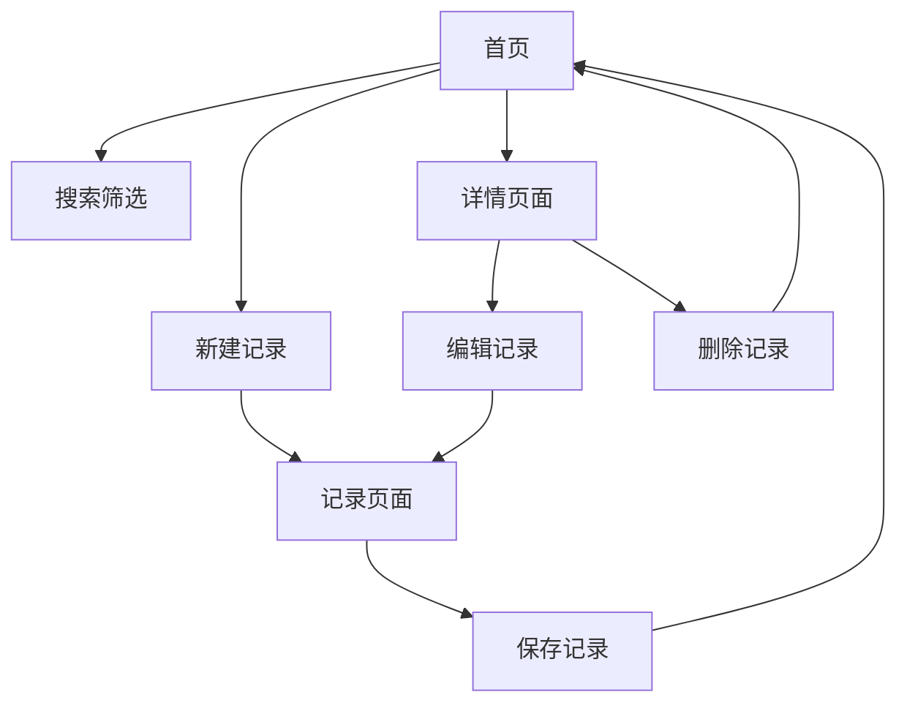

## 1. 产品概述
树洞空间是一个私密的心情记录和日常记事应用。用户可以安全地记录生活点滴、心情变化，通过分类和时间筛选快速找到历史记录。

面向需要私密空间记录生活、情感和思考的个人用户，提供简洁、安全的记录体验。

## 2. 核心功能

### 2.1 用户角色
| 角色 | 注册方式 | 核心权限 |
|------|----------|----------|
| 普通用户 | 本地使用，无需注册 | 创建、编辑、删除记录，分类管理，时间筛选 |

### 2.2 功能模块
树洞空间包含以下核心页面：
1. **首页**：记录列表展示，快速搜索和筛选
2. **记录页面**：创建和编辑记录，心情标签，分类选择
3. **详情页面**：查看单条记录详情，编辑删除操作

### 2.3 页面详情
| 页面名称 | 模块名称 | 功能描述 |
|-----------|-------------|-------------|
| 首页 | 记录列表 | 展示所有记录按时间倒序排列，支持滚动加载 |
| 首页 | 搜索筛选栏 | 输入关键词搜索，选择分类筛选，设置时间范围筛选 |
| 首页 | 快速操作 | 新建记录按钮，分类管理入口 |
| 记录页面 | 编辑器 | 支持多行文本输入，自动保存草稿 |
| 记录页面 | 心情选择 | 提供预设心情图标和颜色标识 |
| 记录页面 | 分类选择 | 选择已有分类或创建新分类 |
| 记录页面 | 保存操作 | 保存记录，返回首页 |
| 详情页面 | 记录展示 | 显示完整内容、心情、分类、创建时间 |
| 详情页面 | 操作按钮 | 编辑记录，删除记录，返回首页 |

## 3. 核心流程
用户操作流程：
1. 用户进入首页查看历史记录列表
2. 可通过搜索框输入关键词快速查找
3. 使用分类筛选选择特定类型记录
4. 设置时间范围筛选特定时期记录
5. 点击新建按钮进入记录页面
6. 输入内容，选择心情和分类
7. 保存后返回首页查看最新记录
8. 点击记录进入详情页面查看完整内容
9. 可在详情页面编辑或删除记录

## 4. 用户界面设计

### 4.1 设计风格
- **主色调**：温暖木质色 (#D4A574) 搭配深灰色文字 (#2C3E50)
- **按钮样式**：圆角矩形，悬停有轻微阴影效果
- **字体**：系统默认字体，标题18px，正文14px，小字12px
- **布局风格**：卡片式布局，内容间距16px，整体居中显示
- **图标风格**：简约线性图标，心情使用彩色表情符号

### 4.2 页面设计概览
| 页面名称 | 模块名称 | UI元素 |
|-----------|-------------|-------------|
| 首页 | 记录卡片 | 白色圆角卡片，阴影效果，显示标题预览、时间、心情图标 |
| 首页 | 搜索栏 | 顶部固定，圆角输入框，搜索图标在左侧 |
| 首页 | 筛选器 | 下拉选择分类，日期范围选择器 |
| 记录页面 | 编辑器 | 全宽文本域，最小高度200px，边框在聚焦时变色 |
| 记录页面 | 心情选择 | 横向滚动的心情图标列表，选中状态放大 |
| 记录页面 | 分类选择 | 下拉菜单显示已有分类，可输入创建新分类 |
| 详情页面 | 内容区 | 白色背景，适当内边距，时间显示在右上角 |

### 4.3 响应式设计
采用桌面端优先设计，在移动端自适应调整：
- 桌面端：最大宽度800px居中显示
- 平板端：保持相似布局，适当调整间距
- 手机端：全屏显示，简化操作按钮为底部固定