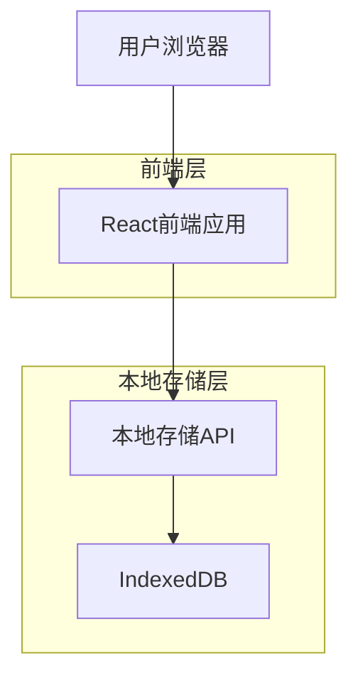
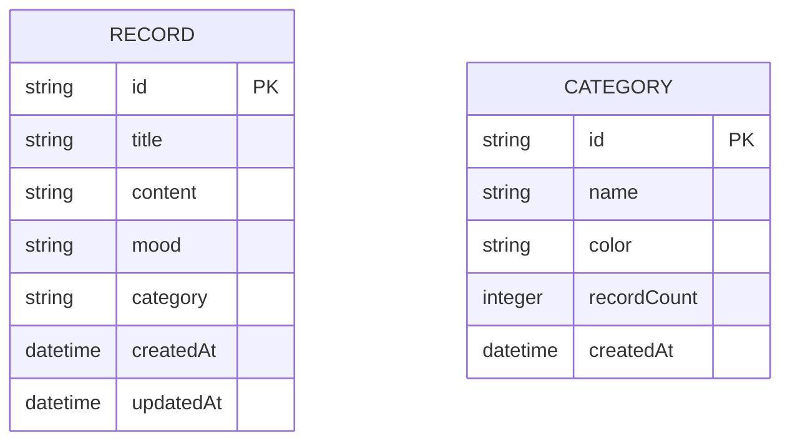

## 1. 架构设计



## 2. 技术描述

- **前端**: React@18 + tailwindcss@3 + vite
- **初始化工具**: vite-init
- **本地存储**: IndexedDB (通过localforage库)
- **后端**: 无（纯前端应用）

## 3. 路由定义

| 路由 | 用途 |
|-------|---------|
| / | 首页，显示记录列表和筛选功能 |
| /new | 新建记录页面 |
| /edit/:id | 编辑记录页面 |
| /detail/:id | 记录详情页面 |

## 4. 数据模型

### 4.1 数据模型定义



### 4.2 数据定义

记录表 (records)
```javascript
// IndexedDB存储结构
{
  id: string, // UUID
  title: string, // 记录标题
  content: string, // 记录内容
  mood: string, // 心情标识 (happy/sad/angry/calm/excited)
  category: string, // 分类ID
  createdAt: Date,
  updatedAt: Date
}
```

分类表 (categories)
```javascript
{
  id: string, // UUID
  name: string, // 分类名称
  color: string, // 颜色代码
  recordCount: number, // 记录数量
  createdAt: Date
}
```

### 4.3 本地存储实现

使用IndexedDB存储所有数据，确保数据持久性和较大存储空间：

```javascript
// 初始化数据库
const db = await openDB('treehole-db', 1, {
  upgrade(db) {
    // 创建记录表
    const recordStore = db.createObjectStore('records', { keyPath: 'id' });
    recordStore.createIndex('category', 'category');
    recordStore.createIndex('createdAt', 'createdAt');
    
    // 创建分类表
    const categoryStore = db.createObjectStore('categories', { keyPath: 'id' });
    categoryStore.createIndex('name', 'name');
  }
});
```

## 5. 核心功能实现

### 5.1 数据操作API

```javascript
// 记录相关操作
class RecordService {
  // 获取所有记录
  async getAllRecords(filters = {}) {
    // 支持按分类、时间范围、关键词筛选
  }
  
  // 创建记录
  async createRecord(data) {
    // 保存到IndexedDB
  }
  
  // 更新记录
  async updateRecord(id, data) {
    // 更新IndexedDB中的记录
  }
  
  // 删除记录
  async deleteRecord(id) {
    // 从IndexedDB删除记录
  }
}

// 分类相关操作
class CategoryService {
  // 获取所有分类
  async getAllCategories() {
    // 从IndexedDB获取分类列表
  }
  
  // 创建分类
  async createCategory(name, color) {
    // 保存新分类
  }
}
```

### 5.2 搜索和筛选逻辑

```javascript
// 多条件筛选实现
function filterRecords(records, { keyword, category, startDate, endDate }) {
  return records.filter(record => {
    const matchKeyword = !keyword || 
      record.title.includes(keyword) || 
      record.content.includes(keyword);
    
    const matchCategory = !category || record.category === category;
    
    const matchDate = (!startDate || record.createdAt >= startDate) &&
      (!endDate || record.createdAt <= endDate);
    
    return matchKeyword && matchCategory && matchDate;
  });
}
```